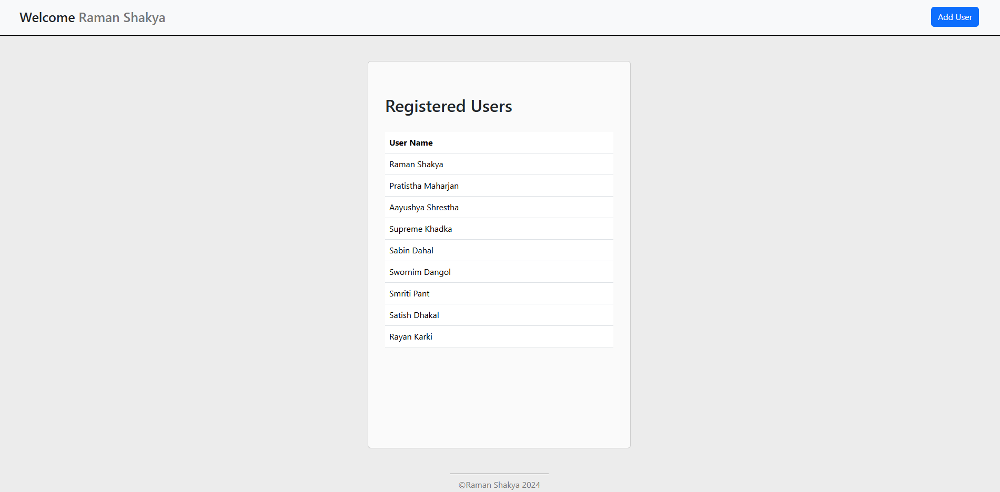
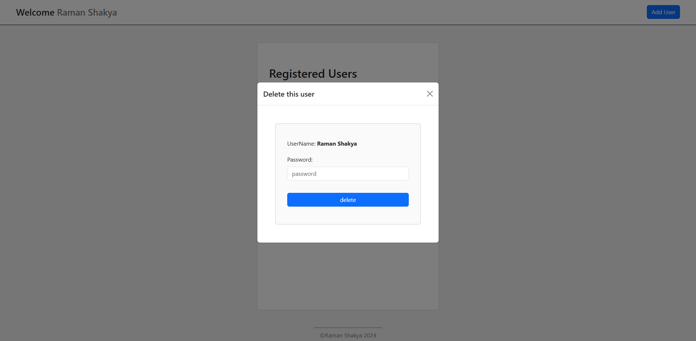
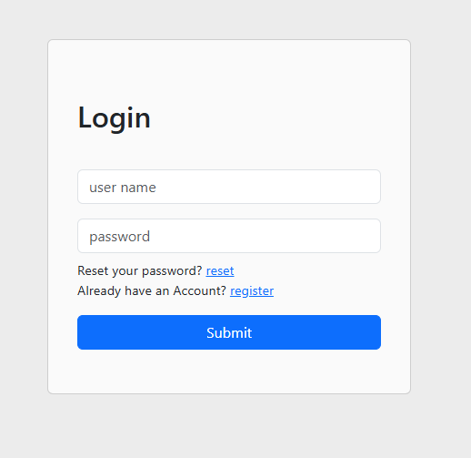
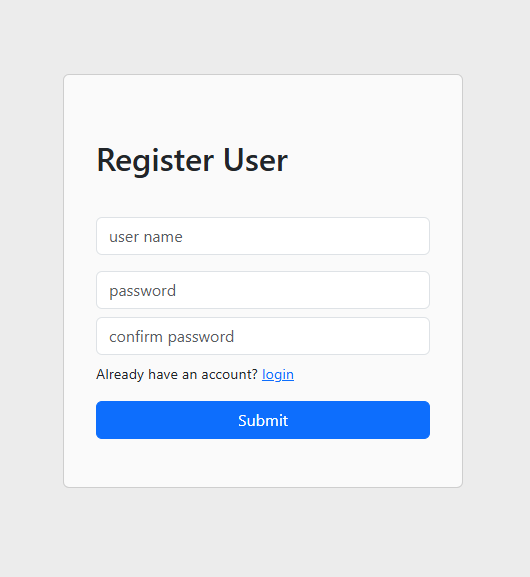
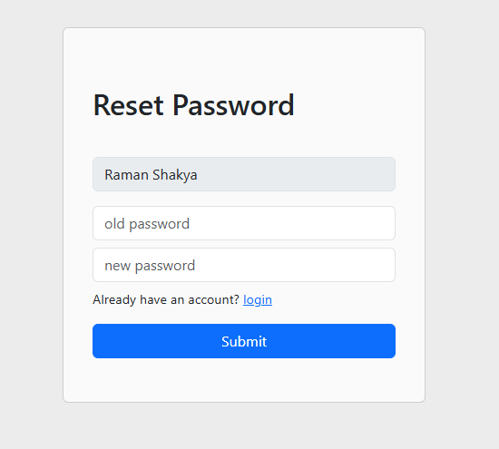

# User System
## Tasks
1. Create CRUD operation for user registration and also include user login and password reset (user mongodb for database)
2. Create Table using jQuery, HTML, CSS, Bootstrap (jQuery DOM manipulation) to display the registered users
3. Pop up modal when click rows of table with jQuery Events ad Bootstrap
4. Simple Http request from Frontend to backend using Axios.

> MERN solution to handle CRUD for users with (userName and password)

## Starting guide
1. Start Mongodb server using `MongodbCompass`, and create a document named `userdb`
2. Install required packages
    ```bash
    cd backend
    npm i
    ```
3. Start backend
    ```bash
    cd backend
    npm run start
    ```
4. Start frontend
    ```bash
    cd frontend
    npx http-server --port 5500
    ```
    > use port 5500 as it was defined to listen on the server.

## Database
`MongoDB` is used as database with collection `user` has the following fields:
1. userName
2. password

## Backend
`Express` server is used to handle APIs which performs CRUD operations on `user` database.
List of APIs:
1. **GET `/user`**
    Returns list of all users including `userName` and `password`

2. **POST `/user`**
    Adds a new user given `userName` and `password` in the **POST** request body

3. **POST `/login`**
    Logs in given `userName` and `password` in the **POST** request body and returns a JWT token

4. **PUT `/user/reset-password`**
    Resets a password of a given user by specifying `userName` and `password` field in the **PUT** request body

5. **DELETE `/user/remove`**
    Deletes a user given `userName` and `password` only if password matches specified in the **DELETE** request body

6. **GET `/user/auth`**
    Gives username based on `cookie`, checks if the user is logged in.

## Frontend
Basic HTML with jquery, bootstrap, SASS and axios was used. Browser's cookie storage was used for authentication process.
* **Home-page**
    1. Checks if the user is logged in (backend cookie testing)
        1. if yes fetch all usernames using single api **GET `/user`**
        2. else redirect to login page
    2. Show all usernames in table using jQuery DOM manipulation.
    3. Add onClick event to table row to open a popup modal
        1. contains a password field and delete button
        2. if correct credentials are supplied, the user gets deleted
        3. else an alert is made 
    **Images**
    
    

* **Login-page**
    1. Has username, password fields and submit button (form)
    2. if all fields are filled and submit button is clicked, an API **POST `/user/login`** is sent to get the token
        1. if fields are valid, generate a JWT token and return it
        2. else return an error
    3. if logged in goto *Home-page*
    **Images**
    

* **Registration-page**
    1. Has username, password and confirm-password fields and submit button (form)
    2. if all fields are filled and submit button is clicked, an API **POST `/user`** is sent to create a user and get the token
        1. create a user with given details
        2. generate a JWT token and return it
    3. if logged in goto *Home-page*

    **Images**
    

* **Reset-password-page**
    1. Checks if user is logged in, else redirected to login page
    2. Has old-password and new-password fields and submit button (form)
    3. on submit, API **PUT `/user/reset-password`** is called
        1. username is fetched from cookie, else return an error
        2. replace every password with matching username and password, (username and password are candidate key)
        3. return if replacement was successful
    4. if successful goto home page

    **Images**
    